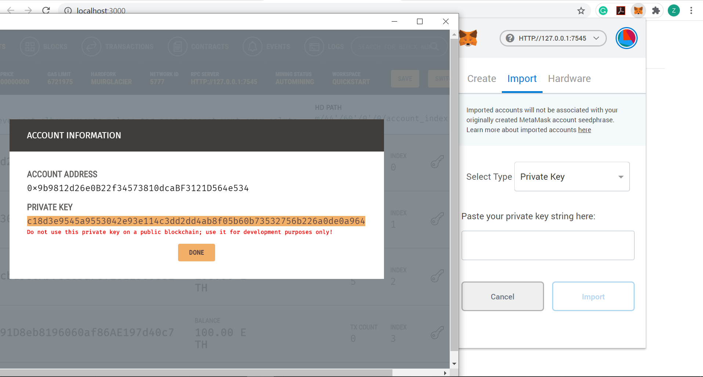

## Tutorial on DApp - Museum Pass Card Promotions
Note: This tutorial follows the logic of [The Ultimate Ethereum Dapp Tutorial](https://www.dappuniversity.com/articles/the-ultimate-ethereum-dapp-tutorial)

### Background
In this tutorial, We can learn how to build a web application where customers can get/remove museums' pass cards. Pass cards from different museums have different expiration date, and every museum has a limitation on the number of pass cards they released.  

If we were to build our application on the centralized web, we’d run into a few problems:
1. The data on the database could be changed: expiration date of pass cards could be changed, so one pass card could be used forever in this case; the number limitation of museums' pass cards could be changed, unlimited free pass cards would cause a huge loss for museums.
2. The source code on the web server could also be changed at any time.

> Instead of a centralized database, all the transaction data that is shared across the nodes in the blockchain is contained in bundles of records called blocks, which are chained together to create the public ledger. This public ledger represents all the data in the blockchain. All the data in the public ledger is secured by cryptographic hashing, and validated by a consensus algorithm. Nodes on the network participate to ensure that all copies of the data distributed across the network are the same.  

For these reasons, we can build it on the blockchain to ensure that the information of pass cards and its number limitation cannot be changed, and people cannot get the duplicate pass cards from the same museums if they've already got one.  

For users of this application, they needs an account with a wallet address with some Ether. Once they connect to the network, they can get and remove their pass cards and pay "gas" to write their transactions to the blockchain.  

We'll build the front-end client written in HTML, CSS, and Javascript. This client will connect to Ganache, a local Ethereum blockchain. And we’ll code all the business logic about our DApp in the smart contract written in the Solidity. We'll develop our DApp in the Truffle framework. MetaMask needs to be pre-installed on chrome with the private account imported from Ganache to connect to the local Ethereum blockchain, and interact with the smart contract deployed on the blockchain. Other dependencies are listed in the [last section](#dependencies) of this tutorial.

### Install Framework and Softwares
* Install Truffle with NPM
```console
$ npm install -g truffle
```
* [Install Ganache](https://www.trufflesuite.com/ganache)
* [Get Metamask extension for Google Chrome](https://chrome.google.com/webstore/detail/metamask/nkbihfbeogaeaoehlefnkodbefgpgknn?hl=en)

### Step1 - Model Museums
Open Ganache and have a local blockchain running. Ganache gave us 10 accounts preloaded with 100 fake Ether. Each account has a unique address and a private key. Each account address will serve as a unique identifier for each user in our DApp.  


Now let's create a project directory for our DApp in the command line like this:
```console
$ mkdir museum
$ cd museum
```

Inside our newly created directory, Get up and run fast with a fundamental Truffle box:
```console
$ truffle unbox pet-shop
```  

From the root of our project, create a new contract file in the contracts directory like this:
```console
$ touch contracts/Passcard.sol
```
Or we can create it manually. Also in this contracts directory, delete `Migrations.sol`.

We need a way to store multiple museums, and store multiple attributes about each museum. We want to keep track of a museum's id, name, description, address, open hours, avatar image source path, the expiration date of pass cards and to count the number of remaining pass cards of a museum. Here is how we will model the museum - Open the `Passcard.sol` file and start with the following code:
```solidity
pragma solidity 0.5.16;

contract Passcard {

  //Model a Museum
  struct Museum {
    uint id;
    string name;
    string description;
    string addr;
    string hour;
    string imgsrc;
    string expire_date;
    uint count_remain;
  }

}
```
We have modeled the museum with a Solidity Struct. We specified that this struct has an id of unsigned integer type, name of string type, description of string type, address of string type, open hours of string type, image path of string type, expiration date of string type, and remaining number of pass cards of unsigned integer type.  

We need a place to store the `Museum` structure type that we've just created. We can do this with a Solidity mapping.
```solidity
pragma solidity 0.5.16;

contract Passcard {

  //Model a Museum
  struct Museum {
    uint id;
    string name;
    string description;
    string addr;
    string hour;
    string imgsrc;
    string expire_date;
    uint count_remain;
  }

  //Read/Write museums' information
  mapping(uint => Museum) public museums;

}
```
In this case, the key to the mapping is an unsigned integer, and the value is a Museum structure type that we just defined. This essentially gives us an id-based look up for each museum.   

Next, we keep track of how many museums exist in the contract with a counter cache state variable  `museumsCount` like this:
```solidity
pragma solidity 0.5.16;

contract Passcard {

  //Model a Museum
  struct Museum {
    uint id;
    string name;
    string description;
    string addr;
    string hour;
    string imgsrc;
    string expire_date;
    uint count_remain;
  }

  //Read/Write museums' information
  mapping(uint => Museum) public museums;

  //keep track of museum counts
  uint public museumsCount;

}
```
In Solidity, there is no way to determine the size of a mapping, and no way to iterate over it, either. Therefore, we should use a counter cache.  

Next, let's create a function to add museums to the mapping we've created like this:
```solidity
contract Passcard {
  // ...

  //function for adding museum
  function addMuseum (string memory _name, string memory _description,
    string memory _addr, string memory _hours, string memory _imgsrc,
    string memory _date, uint _count) private {
      museumsCount += 1;
      museums[museumsCount] = Museum(museumsCount, _name, _description, _addr, _hours,
        _imgsrc, _date, _count);
    }

}
```
Inside the function, we increment the `museumsCount` counter cache to denote that a new museum has been added. Then we update the mapping with a new Museum struct, using the current `museumsCount` count as the key. The initialized museum id is also the current `museumsCount` count.  

Now we can add four museums with mock data to our contract by calling the `addMuseum` function four times inside the constructor function like this:
```solidity
contract Passcard {
  // ...

  //Constructor
  constructor() public {
    //add mock data
    addMuseum("Royal Ontario Museum",
    "It is one of the largest museums in North America and the largest in Canada.",
    "100 Queens Park, Toronto, ON", "Mon-Fri, 10a.m.-5:30p.m.", "./images/on_royal.jpg", "2020-09-15", 10);

    addMuseum("Gardiner Museum",
    "The collection is made up of two types of ceramics, earthenware, and porcelain.",
    "111 Queens Park, Toronto, ON", "Mon-Fri, 10a.m.-6:00p.m.", "./images/gardiner.jpg", "2020-10-08", 30);

    addMuseum("Art Gallery of Ontario",
    "Its permanent collection represents many artistic movements and eras of art history.",
    "317 Dundas St W, Toronto, ON", "Mon-Fri, 10:30a.m.-5p.m.", "./images/ago.jpg", "2020-11-20", 25);

    addMuseum("Textile Museum of Canada",
    "It is a museum dedicated to the collection, exhibition, and documentation of textiles.",
    "55 Centre Ave, Toronto, ON", "Mon-Sun, 11a.m.-5p.m.", "./images/textile.jpg", "2020-12-16", 1);
  }

  // ...
}
```

At this point, your contract code should look like this:
```solidity
pragma solidity 0.5.16;

contract Passcard {

  //Model a Museum
  struct Museum {
    uint id;
    string name;
    string description;
    string addr;
    string hour;
    string imgsrc;
    string expire_date;
    uint count_remain;
  }

  //Read/Write museums' information
  mapping(uint => Museum) public museums;

  //keep track of museum counts
  uint public museumsCount;

  //Constructor
  constructor() public {
    //add mock data
    addMuseum("Royal Ontario Museum",
    "It is one of the largest museums in North America and the largest in Canada.",
    "100 Queens Park, Toronto, ON", "Mon-Fri, 10a.m.-5:30p.m.", "./images/on_royal.jpg", "2020-09-15", 10);

    addMuseum("Gardiner Museum",
    "The collection is made up of two types of ceramics, earthenware, and porcelain.",
    "111 Queens Park, Toronto, ON", "Mon-Fri, 10a.m.-6:00p.m.", "./images/gardiner.jpg", "2020-10-08", 30);

    addMuseum("Art Gallery of Ontario",
    "Its permanent collection represents many artistic movements and eras of art history.",
    "317 Dundas St W, Toronto, ON", "Mon-Fri, 10:30a.m.-5p.m.", "./images/ago.jpg", "2020-11-20", 25);

    addMuseum("Textile Museum of Canada",
    "It is a museum dedicated to the collection, exhibition, and documentation of textiles.",
    "55 Centre Ave, Toronto, ON", "Mon-Sun, 11a.m.-5p.m.", "./images/textile.jpg", "2020-12-16", 1);
  }

  //function for adding museum
  function addMuseum (string memory _name, string memory _description,
    string memory _addr, string memory _hours, string memory _imgsrc,
    string memory _date, uint _count) private {
      museumsCount += 1;
      museums[museumsCount] = Museum(museumsCount, _name, _description, _addr, _hours,
        _imgsrc, _date, _count);
    }
}
```

Next we'll need to create a new file in the "migrations" directory. From our project root, create a new file from the command line like this:
```console
$ touch migrations/1_museum_passcard.js
```
Or we can create it manually. Also we need to delete `1_initial_migration.js` there.

Let's create a new migration to deploy the contract like this:
```javascript
let Passcard = artifacts.require("./Passcard.sol");

module.exports = function(deployer) {
  deployer.deploy(Passcard);
};
```

Now let's run our migrations from the command line like this:
```console
$ truffle migrate
```
Make sure the Ganache is running at the same time.

Now that we have successfully migrated our smart contract to the local Ethereum blockchain, let's open the console to interact with the smart contract. You can open the truffle console from the command line like this:
```console
$ truffle console
```

Now that we're inside the console, let's get an instance of our deployed smart contract and see if we can read the museum's information from the contract.  

From the console, run this code:
```console
Passcard.deployed().then(function(instance) { app = instance })
```
Now we can get information of our museums, for instance, to get our first museum, we can write code in truffle console like this:
```console
app.museums(1).then(function(i) {museum = i})
```
And read its information like this:
```console
museum[0].toNumber()    //read the id of the museum
museum[1]    //read the name of the museum
museum[2]    //read the description of the museum
museum[3]    //read the address of the museum
museum[4]    //read the open hours of the museum
museum[5]    //read where the avatar image of the museum stored
museum[6]    //read the expiration date of the museums' pass cards
museum[7].toNumber()  //read the number of remaining pass cards users can get from this museum
```

Congratulations! You've just written your first smart contract, deployed to the blockchain, and retrieved some of its data.

Note: For images of the four museums in our contract, we can download their images from websites and store them in the `src/images` directory, and name it with `on_royal.jpg`, `gardiner.jpg`, `ago.jpg`, `textile.jpg` separately. And we can delete images `golden-retriever.jpeg`, `boxer.jpeg`, `french-bulldog.jpeg`, `scottish-terrier.jpeg` in that directory.

### Step2 - Test Museum Model
Now let's write some tests. Make sure you have Ganache running first. Then, create a new test file in the command line from the root of our project like this:
```console
$ touch test/passcard.js
```
Or we can create it manually.  

We'll write some tests in Javascript to simulate client-side interaction with our smart contract, much like we did in the console.  

Here is the code for the tests:
```javascript
let Passcard = artifacts.require("./Passcard.sol");

contract("Passcard", function(accounts) {
  let passcardInstance;

  it("initializes with four museums", function() {
    return Passcard.deployed().then(function(instance) {
      return instance.museumsCount();
    }).then(function(count) {
      assert.equal(count, 4);
    });
  });

  it("it initializes the museums with the correct values", function() {
    return Passcard.deployed().then(function(instance) {
      passcardInstance = instance;
      return passcardInstance.museums(1);
    }).then(function(museum) {

      assert.equal(museum[0], 1, "contains the correct id");
      assert.equal(museum[1], "Royal Ontario Museum", "contains the correct name");
      assert.equal(museum[2], "It is one of the largest museums in North America and the largest in Canada.", "contains the correct description");
      assert.equal(museum[3], "100 Queens Park, Toronto, ON", "contains the correct address");
      assert.equal(museum[4], "Mon-Fri, 10a.m.-5:30p.m.", "contains the correct hours");
      assert.equal(museum[5], "./images/on_royal.jpg", "contains the correct img path");
      assert.equal(museum[6], "2020-09-15", "contains the correct expiration date");
      assert.equal(museum[7], 10, "contains the correct number of pass cards");

      return passcardInstance.museums(2);
    }).then(function(museum) {

      assert.equal(museum[0], 2, "contains the correct id");
      assert.equal(museum[1], "Gardiner Museum", "contains the correct name");
      assert.equal(museum[2], "The collection is made up of two types of ceramics, earthenware, and porcelain.", "contains the correct description");
      assert.equal(museum[3], "111 Queens Park, Toronto, ON", "contains the correct address");
      assert.equal(museum[4], "Mon-Fri, 10a.m.-6:00p.m.", "contains the correct hours");
      assert.equal(museum[5], "./images/gardiner.jpg", "contains the correct img path");
      assert.equal(museum[6], "2020-10-08", "contains the correct expiration date");
      assert.equal(museum[7], 30, "contains the correct number of pass cards");

      return passcardInstance.museums(3);
    }).then(function(museum) {

      assert.equal(museum[0], 3, "contains the correct id");
      assert.equal(museum[1], "Art Gallery of Ontario", "contains the correct name");
      assert.equal(museum[2], "Its permanent collection represents many artistic movements and eras of art history.", "contains the correct description");
      assert.equal(museum[3], "317 Dundas St W, Toronto, ON", "contains the correct address");
      assert.equal(museum[4], "Mon-Fri, 10:30a.m.-5p.m.", "contains the correct hours");
      assert.equal(museum[5], "./images/ago.jpg", "contains the correct img path");
      assert.equal(museum[6], "2020-11-20", "contains the correct expiration date");
      assert.equal(museum[7], 25, "contains the correct number of pass cards");

      return passcardInstance.museums(4);
    }).then(function(museum) {

      assert.equal(museum[0], 4, "contains the correct id");
      assert.equal(museum[1], "Textile Museum of Canada", "contains the correct name");
      assert.equal(museum[2], "It is a museum dedicated to the collection, exhibition, and documentation of textiles.", "contains the correct description");
      assert.equal(museum[3], "55 Centre Ave, Toronto, ON", "contains the correct address");
      assert.equal(museum[4], "Mon-Sun, 11a.m.-5p.m.", "contains the correct hours");
      assert.equal(museum[5], "./images/textile.jpg", "contains the correct img path");
      assert.equal(museum[6], "2020-12-16", "contains the correct expiration date");
      assert.equal(museum[7], 1, "contains the correct number of pass cards");
    });
  });
});
```
The first test checks that the contract was initialized with the correct number of museums by checking the museum count is equal to 4. The next test inspects the values of each museum, ensuring that each museum has the correct id, name, description, address, open hours, image path, expiration date, and the number of pass cards.  

Now let's run the tests from the command line like this:
```console
$ truffle test
```
Please notice that you need to exit truffle console and type the above command in the normal console.  

Congratulations! You have passed all the tests so far.

### Step3 - Model User Information and Add Functions
We need a way to count the number of pass cards that a user already got, and also keep track of their pass cards information. We can use a mapping to record whether the user got the pass card from a museum with a specified id. Here is how we will model the user information in `Passcard.sol`:
```solidity
contract Passcard {
    // ...

    // Model the user information
    struct UserInfo {
      uint passcardsCount;
      mapping(uint => bool) passcardsValid;
      bool exist;
    }

    // ...
}
```
We specified that this struct has a `passcardsCount` of unsigned integer type to count the number of pass cards the user got, and a Solidity mapping `passcardsValid` to record whether the user got the pass card from the specified museum - the museum has an id of unsigned integer type. Besides, we set a boolean variable `exist` to help check whether the user exists in the global `users` mapping, which we will introduce next.  

We need a place to store the `UserInfo` structure type that we've just created. We can do this with a Solidity mapping `users`:
```solidity
contract Passcard {
    // ...

    // Model the user information
    struct UserInfo {
      uint passcardsCount;
      mapping(uint => bool) passcardsValid;
    }

    // ...

    // Read/Write users' information
    mapping(address => UserInfo) public users;

    // ...
}
```
In this case, the key to the mapping is the account address of the user, and the value is a `UserInfo` structure type that we just defined. This essentially gives us an address-based look up for each user.

Now let's add the ability to get pass cards for users by adding a "get passcard" function:
```solidity
contract Passcard {
  // ...

  function getPasscard (uint _museumId) public {

    if (!users[msg.sender].exist) {
      // initialize user information
      users[msg.sender] = UserInfo({passcardsCount: 0, exist: true});
    } else {
      // require that the user can't get the same pass card twice
      require(!users[msg.sender].passcardsValid[_museumId]);
    }

    // require a valid museumId
    require(_museumId > 0 && _museumId <= museumsCount);

    //require the number of remaining pass cards for the museum is larger than zero
    require(museums[_museumId].count_remain > 0);

    // record that user got the pass card
    users[msg.sender].passcardsValid[_museumId] = true;

    // update count of pass cards for that user
    users[msg.sender].passcardsCount += 1;

    //update the number of remaining pass cards for the museum
    museums[_museumId].count_remain -= 1;

  }

  // ...
}
```
In this `getPasscard` function, if the user's account address doesn't exist in the `users` mapping, it will initialize the user information by setting `passcardsCount` to 0 and `exist` to `true`.  

The core functionality is as follows: set the boolean for the specified museum id in the mapping `passcardsValid` to `true`; increase `passcardsCount` by 1; decrease the museum's number of remaining pass cards by 1.  

It also implements require statements that will stop execution if the conditions are not met: first require that the user can't get the passcard if he/she've already got a same one; second require that the museum id is valid; third require that the number of the museum's remaining pass cards is larger than zero.

Next let's add the ability for users to remove pass cards by adding a "remove passcard" function:
```solidity
contract Passcard {
  // ...

  function removePasscard (uint _museumId) public {
    // require the user exists in mapping and got passcards before
    require(users[msg.sender].exist);

    // require that the user has the passcard with id _museumId
    require(users[msg.sender].passcardsValid[_museumId]);

    // require a valid museumId
    require(_museumId > 0 && _museumId <= museumsCount);

    // record that user removes the passcard
    users[msg.sender].passcardsValid[_museumId] = false;

    // update count of passcards for that user
    users[msg.sender].passcardsCount -= 1;

    //update the number of remaining pass cards for the museum
    museums[_museumId].count_remain += 1;

  }

  // ...
}
```
The core functionality of this `removePasscard` function is as follows: set the boolean for the specified museum id in the mapping `passcardsValid` to be `false`, decrease `passcardsCount` by 1, and increase the museum's number of remaining pass cards by 1.  

It also implements require statements that will stop execution if the conditions are not met: first require that the user exists in `users` mapping and got passcards before; second require that the user has the pass card with the specified museum id; third require that the museum id is valid.  

Now let's add the function to help check whether the user has the pass card of a specified museum:
```solidity
contract Passcard {
  // ...

  //check if the user has the pass card of the museum with id _museumId
  function getPcValid (uint _museumId) public returns (bool) {
    return (users[msg.sender].passcardsValid[_museumId]);
  }

  // ...
}
```
We set this function to be public since it's helpful to call it outside the contract.

At this point, your contract code should look like this:
```solidity
pragma solidity 0.5.16;

contract Passcard {

  //Model a Museum
  struct Museum {
    uint id;
    string name;
    string description;
    string addr;
    string hour;
    string imgsrc;
    string expire_date;
    uint count_remain;
  }

  // Model the user information
  struct UserInfo {
    uint passcardsCount;
    mapping(uint => bool) passcardsValid;
    bool exist;
  }

  //Read/Write museums' information
  mapping(uint => Museum) public museums;

  //keep track of museum counts
  uint public museumsCount;

  // Read/Write users' information
  mapping(address => UserInfo) public users;

  //Constructor
  constructor() public {
    //add mock data
    addMuseum("Royal Ontario Museum",
    "It is one of the largest museums in North America and the largest in Canada.",
    "100 Queens Park, Toronto, ON", "Mon-Fri, 10a.m.-5:30p.m.", "./images/on_royal.jpg", "2020-09-15", 10);

    addMuseum("Gardiner Museum",
    "The collection is made up of two types of ceramics, earthenware, and porcelain.",
    "111 Queens Park, Toronto, ON", "Mon-Fri, 10a.m.-6:00p.m.", "./images/gardiner.jpg", "2020-10-08", 30);

    addMuseum("Art Gallery of Ontario",
    "Its permanent collection represents many artistic movements and eras of art history.",
    "317 Dundas St W, Toronto, ON", "Mon-Fri, 10:30a.m.-5p.m.", "./images/ago.jpg", "2020-11-20", 25);

    addMuseum("Textile Museum of Canada",
    "It is a museum dedicated to the collection, exhibition, and documentation of textiles.",
    "55 Centre Ave, Toronto, ON", "Mon-Sun, 11a.m.-5p.m.", "./images/textile.jpg", "2020-12-16", 1);
  }

  //function for adding museum
  function addMuseum (string memory _name, string memory _description,
    string memory _addr, string memory _hours, string memory _imgsrc,
    string memory _date, uint _count) private {
      museumsCount += 1;
      museums[museumsCount] = Museum(museumsCount, _name, _description, _addr, _hours,
        _imgsrc, _date, _count);
    }

  function getPasscard (uint _museumId) public {

    if (!users[msg.sender].exist) {
      // initialize user information
      users[msg.sender] = UserInfo({passcardsCount: 0, exist: true});
    } else {
      // require that the user can't get the same pass card twice
      require(!users[msg.sender].passcardsValid[_museumId]);
    }

    // require a valid museumId
    require(_museumId > 0 && _museumId <= museumsCount);

    //require the number of remaining pass cards for the museum is larger than zero
    require(museums[_museumId].count_remain > 0);

    // record that user got the pass card
    users[msg.sender].passcardsValid[_museumId] = true;

    // update count of pass cards for that user
    users[msg.sender].passcardsCount += 1;

    //update the number of remaining pass cards for the museum
    museums[_museumId].count_remain -= 1;

  }

  function removePasscard (uint _museumId) public {
    // require the user exists in mapping and got passcards before
    require(users[msg.sender].exist);

    // require that the user has the passcard with id _museumId
    require(users[msg.sender].passcardsValid[_museumId]);

    // require a valid museumId
    require(_museumId > 0 && _museumId <= museumsCount);

    // record that user removes the passcard
    users[msg.sender].passcardsValid[_museumId] = false;

    // update count of passcards for that user
    users[msg.sender].passcardsCount -= 1;

    //update the number of remaining pass cards for the museum
    museums[_museumId].count_remain += 1;

  }

  //check if the user has the pass card of the museum with id _museumId
  function getPcValid (uint _museumId) public returns (bool) {
    return (users[msg.sender].passcardsValid[_museumId]);
  }
}
```

Now let's migrate our contract like this:
```console
$ truffle migrate --reset
```

### Step4 - Test User Model and Functions
Now let's add some tests to our `passcard.js` test file:
```javascript
contract("Passcard", function(accounts) {
  // ...

  it("allows a user to get and remove a pass card", function() {
    return Passcard.deployed().then(function(instance) {
      passcardInstance = instance;
      museumId = 1;
      return passcardInstance.getPasscard(museumId, { from: accounts[0] });
    }).then(function(receipt) {
      return passcardInstance.users(accounts[0]);
    }).then(function(userinfo) {
      assert.equal(userinfo.passcardsCount, 1, "increments the user's pass card count");
      return passcardInstance.getPcValid.call(museumId, { from: accounts[0] });
    }).then(function(valid_status){
      assert.equal(valid_status, true, "the user got the pass card of museum1");
      return passcardInstance.removePasscard(museumId, { from: accounts[0] });
    }).then(function(receipt) {
      return passcardInstance.users(accounts[0]);
    }).then(function(userinfo) {
      assert.equal(userinfo.passcardsCount, 0, "deducts the user's pass card count");
      return passcardInstance.getPcValid.call(museumId, { from: accounts[0] });
    }).then(function(valid_status) {
      assert.equal(valid_status, false, "the user removed the pass card of museum1");
    });
  });

  // ...
});
```
Here we test several things: the `getPasscard` function increments the number of pass cards for the user, and sets value for "museumId" in the user's `passcardsValid` mapping to be `true`; the `removePasscard` function decreases the number of pass cards for the user, and sets corresponding value in the `passcardsValid` mapping to be `false`. Also it tests the user is added to the `users` mapping.

Now let's write a test to ensure the count of remaining pass cards of a museum varies when the user gets one from the museum or removes the one he/she had:
```javascript
it("the number of remaining pass cards for museums varies when the user gets one or removes one", function(){
  return Passcard.deployed().then(function(instance) {
    passcardInstance = instance;
    museumId = 1;
    return passcardInstance.getPasscard(museumId, { from: accounts[0] });
  }).then(function(receipt) {
    return passcardInstance.museums(museumId);
  }).then(function(museum) {
    assert.equal(museum[7], 9, "decrease the count of pass cards left for museum1");
    return passcardInstance.removePasscard(museumId, { from: accounts[0] });
  }).then(function(receipt) {
    return passcardInstance.museums(museumId);
  }).then(function(museum) {
    assert.equal(museum[7], 10, "increment the count of pass cards left for museum1");
  });
});
```

Let's write a test to ensure that our `getPasscard` function throws an exception for invalid museum id:
```javascript
// write a test to ensure that our getPasscard function throws an exception for invalid museum id:
it("throws an exception for invalid museum id in getPasscard", function() {
  return Passcard.deployed().then(function(instance) {
    passcardInstance = instance;
    return passcardInstance.getPasscard(99, { from: accounts[1] })
  }).then(assert.fail).catch(function(error) {
    assert(error.message.indexOf('revert') >= 0, "error message must contain revert");
  });
});
```

Also let's write a test to ensure that our `getPasscard` function throws an exception for getting a passcard if the user already has a same one:
```javascript
it("throws an exception for getting same passcard twice", function() {
  return Passcard.deployed().then(function(instance) {
    passcardInstance = instance;
    museumId = 2;
    return passcardInstance.getPasscard(museumId, { from: accounts[1] });
  }).then(function(receipt) {
    return passcardInstance.users(accounts[1]);
  }).then(function(userinfo) {
    assert.equal(userinfo.passcardsCount, 1, "gets first passcard");
    return passcardInstance.getPcValid.call(museumId, { from: accounts[1] });
  }).then(function(valid_status){
    assert.equal(valid_status, true, "passcard of museum2 is valid");
    // Try to get same passcard again
    return passcardInstance.getPasscard(museumId, { from: accounts[1] });
  }).then(assert.fail).catch(function(error) {
    assert(error.message.indexOf('revert') >= 0, "error message must contain revert");
  });
});
```

Let's write a test to ensure that our `getPasscard` function throws an exception when the  count of remaining pass cards is zero for a museum but the user still tries to get one:
```javascript
it("throws an exception when the count of remaining pass cards is zero for a museum but the user still tries to get one", function() {
  return Passcard.deployed().then(function(instance) {
    passcardInstance = instance;
    museumId = 4;
    return passcardInstance.getPasscard(museumId, { from: accounts[1] });
  }).then(function(receipt) {
    return passcardInstance.getPasscard(museumId, { from: accounts[1] });
  }).then(assert.fail).catch(function(error) {
    assert(error.message.indexOf('revert') >= 0, "error message must contain revert");
  });
});

```

Then let's write a test to ensure that our `removePasscard` function throws an exception for invalid museum id:
```javascript
it("throws an exception for invalid museum id in removePasscard", function() {
  return Passcard.deployed().then(function(instance) {
    passcardInstance = instance;
    return passcardInstance.removePasscard(99, { from: accounts[1] })
  }).then(assert.fail).catch(function(error) {
    assert(error.message.indexOf('revert') >= 0, "error message must contain revert");
  });
});
```

Also let's write a test to ensure that our `removePasscard` function throws an exception when a user tries to remove a pass card that he/she doesn't have:
```javascript
it("throws an exception for users removing invalid pass cards", function() {
  return Passcard.deployed().then(function(instance) {
    passcardInstance = instance;
    museumId = 1;
    return passcardInstance.removePasscard(museumId, { from: accounts[2] });
  }).then(assert.fail).catch(function(error) {
    assert(error.message.indexOf('revert') >= 0, "error message must contain revert");
  });
});
```

Now let's run the tests from the command line like this:
```console
$ truffle test
```

Congratulations! You have passed all the 9 tests so far and we are ready to move on to the client-side.

### Step5 - Client-Side Application
Now let's start building the client-side application that will talk to our smart contract.  

Go ahead and replace all of the content of your `index.html` file inside `src` directory with these lines of code:
```html
<!DOCTYPE html>
<html lang="en">
  <head>
    <meta charset="utf-8">
    <meta http-equiv="X-UA-Compatible" content="IE=edge">
    <meta name="viewport" content="width=device-width, initial-scale=1">
    <title>Museum Pass Card</title>

    <!-- Bootstrap -->
    <link href="css/bootstrap.min.css" rel="stylesheet">
    <!-- customize -->
    <link href="css/museum.css" rel="stylesheet">
  </head>
  <body>
    <div class="container">

      <h3 class="web_title">Museum Pass Card Promotions</h2>
      <p class="web_note">Get the pass card and enjoy one-day free trip!</p>

      <hr>

      <div id="loader">
            <p class="text-center">Loading...</p>
      </div>

      <div id="content" style="display: none;">

      <div class="row_museum" id="card_museums">

      </div>

        <hr>

        <div class="get_museum">
          <h4 class="count_title">Your pass cards: <span id="count">0</span> so far</h4>
          <p id="accountAddress" class="text-center">12345</p>

          <div class="row_museum" id="user_cards">

          </div>

        </div>

      </div>
    </div>

    <!-- jQuery (necessary for Bootstrap's JavaScript plugins) -->
    <script src="https://ajax.googleapis.com/ajax/libs/jquery/1.12.4/jquery.min.js"></script>
    <!-- Include all compiled plugins (below), or include individual files as needed -->
    <script src="js/bootstrap.min.js"></script>
    <script src="js/web3.min.js"></script>
    <script src="js/truffle-contract.js"></script>
    <script src="js/app.js"></script>
  </body>
</html>
```

Now let's create a new CSS file named with `museum.css` in our `src/css` directory, and add these lines of code:
```css
.web_title {
  text-align: center;
}

.web_note {
  text-align: center;
}

hr {
  margin: 5px 0px 10px 0px;
}

.row_museum {
  display: flex;
  flex-direction: row;
  flex-wrap: wrap;
  justify-content: center;
  justify-content: space-around;
}

.card_museum {
  width: 49%;
  min-height: 220px;
  display: flex;
  flex-direction: row;
  align-items: center;
  border: 1px solid #3399ff;
  border-radius: 16px;
  margin-bottom: 10px;
}

.card_museum .left {
  width: 38%;
  height: 99%;
}

.left .image {
  height: 100%;
  width: 95%;
  display: flex;
  align-items: center;
  background-color: #cce6ff;
  border-radius: 16px 0px 0px 16px
}

.image img {
  width: 100%;
  height: auto;
  border-radius: 16px 0px 0px 16px;
}

.card_museum .right {
  width: 62%;
}

.right .card-title {
  text-align: center;
}

.right .card-button {
  display: flex;
  align-items: center;
  justify-content: flex-end;

  color: #1a8cff;
}

.card-button #amount {
  font-weight: bold;
  margin: 0px 3px 0px 3px;
}

.card-button button {
  margin-right: 4%;
  margin-left: 20%
}

.right .card-note {
  color: #1a8cff;
  font-style: italic;
}

.card-note #date {
  font-weight: bold;
  font-style: normal;
}

.count_title {
  text-align: center;
}

.user_card {
  border-color: #33cc33;
}

.user_card .left .image{
  background-color: #c2f0c2;
}

.user_card .right .card-note {
  color: #29a329;
}

.user_card .right .card-button {
  display: flex;
  align-items: center;
  justify-content: flex-end;

  font-weight: bolder;
  font-size: large;
  color: #29a329;
}

.footer {
  display: flex;
  align-items: center;
  justify-content: center;
  margin: 10px 0px 30px 0px;
}
```

Next, replace all of the content of your `app.js` file in the `src/js` directory with these lines of code:
```javascript
App = {
  web3Provider: null,
  contracts: {},
  account: '0x0',

  init: async function() {
    return await App.initWeb3();
  },

  initWeb3: async function() {
  if (window.ethereum) {
      App.web3Provider = window.ethereum;
      await window.ethereum.enable();
      web3 = new Web3(App.web3Provider);
      return App.initContract();
    }
    else {
      App.web3Provider = new Web3.providers.HttpProvider('http://localhost:7545');
      web3 = new Web3(App.web3Provider);
      return App.initContract();
    }
  },

  initContract: function() {
    $.getJSON("Passcard.json", function(passcard) {
      // Instantiate a new truffle contract from the artifact
      App.contracts.Passcard = TruffleContract(passcard);
      // Connect provider to interact with contract
      App.contracts.Passcard.setProvider(App.web3Provider);

      return App.render();
    });
  },

  getPasscard: function(e) {
    let museumId = parseInt(e.target.id.slice(0, 2));
    App.contracts.Passcard.deployed().then(function(instance) {
      return instance.getPasscard(museumId, { from: App.account });
    }).then(function(result) {
      // Wait for votes to update
      $("#content").hide();
      $("#loader").show();
    }).catch(function(err) {
      console.error(err);
    });
  },

  removePasscard: function(e) {
    let museumId = parseInt(e.target.id.slice(0, 2));
    App.contracts.Passcard.deployed().then(function(instance) {
      return instance.removePasscard(museumId, { from: App.account });
    }).then(function(result) {
      // Wait for votes to update
      $("#content").hide();
      $("#loader").show();
    }).catch(function(err) {
      console.error(err);
    });
  },

  render: function() {
    let passcardInstance;
    let loader = $("#loader");
    let content = $("#content");

    loader.show();
    content.hide();

    // Load account data
    web3.eth.getCoinbase(function(err, account) {
      if (err === null) {
        App.account = account;
        $("#accountAddress").html("Your Account: " + account);
      }
    });

    // Load contract data
    App.contracts.Passcard.deployed().then(function(instance) {
      passcardInstance = instance;
      return passcardInstance.museumsCount();
    }).then(async function(museumsCount) {
      // console.log(`museumsCount: ${museumsCount}`)

      let museums_promises = [];
      for (let i = 1; i <= museumsCount; i++) {
        museums_promises.push(passcardInstance.museums(i));
      }

      let museums_array = await Promise.all(museums_promises);

      let museumsListing = $("#card_museums");
      museumsListing.empty();

      for (let i = 0; i < museumsCount; i++) {
          let museum = museums_array[i];

          let id = museum[0];
          let name = museum[1];
          let description = museum[2];
          let addr = museum[3];
          let hour = museum[4];
          let imgsrc = museum[5];
          let expire_date = museum[6];
          let count_remain = museum[7];

          // Render museums in DOM
          let card_museum = document.createElement("div");
          card_museum.className = "card_museum";

          let leftcol = document.createElement("div");
          leftcol.className = "left";

          let imgcontainer = document.createElement("div");
          imgcontainer.className = "image";

          let img = document.createElement("img");
          img.src = imgsrc;
          img.alt = name;

          imgcontainer.appendChild(img);
          leftcol.appendChild(imgcontainer);
          card_museum.appendChild(leftcol);

          let rightcol = document.createElement("div");
          rightcol.className = "right";

          let card_title = document.createElement("h5");
          card_title.className = "card-title";

          let title_text = document.createElement("strong");
          title_text.appendChild(document.createTextNode(name));

          card_title.appendChild(title_text);
          rightcol.appendChild(card_title);

          let card_desc = document.createElement("p");
          card_desc.className = "card-text";
          card_desc.appendChild(document.createTextNode(description));
          rightcol.appendChild(card_desc);

          let card_addr_hour = document.createElement("p");
          card_addr_hour.className = "card-text";

          let card_addr = document.createElement("strong");
          card_addr.appendChild(document.createTextNode("Address: "));
          let addr_text = document.createTextNode(addr);
          let br = document.createElement("br");
          card_addr_hour.appendChild(card_addr);
          card_addr_hour.appendChild(addr_text);
          card_addr_hour.appendChild(br);

          let card_hour = document.createElement("strong");
          card_hour.appendChild(document.createTextNode("Hours: "));
          let hour_text = document.createTextNode(hour);
          card_addr_hour.appendChild(card_hour);
          card_addr_hour.appendChild(hour_text);

          rightcol.appendChild(card_addr_hour);

          let card_note = document.createElement("p");
          card_note.className = "card-text card-note";
          card_note.appendChild(document.createTextNode("Pass card will be expired by "));
          let date_text = document.createElement("span");
          date_text.setAttribute("id", "date");
          date_text.appendChild(document.createTextNode(expire_date));
          card_note.appendChild(date_text);

          rightcol.appendChild(card_note);

          let card_button = document.createElement("div");
          card_button.className = "card-button";
          card_button.appendChild(document.createTextNode("only "));

          let amount = document.createElement("span");
          amount.setAttribute("id", "amount");
          amount.appendChild(document.createTextNode(count_remain));

          card_button.appendChild(amount);
          card_button.appendChild(document.createTextNode(" pass cards left !"));

          let button_valid = document.createElement("button");
          button_valid.setAttribute("id", `${id}-valid`);
          button_valid.type = "button";
          button_valid.className = "btn btn-primary";
          button_valid.onclick = App.getPasscard;
          if (count_remain <= 0) {
            button_valid.disabled = true;
          } else {
            button_valid.disabled = false;
          }
          button_valid.appendChild(document.createTextNode("Get !"));

          card_button.appendChild(button_valid);

          rightcol.appendChild(card_button);

          card_museum.appendChild(rightcol);

          museumsListing.append(card_museum);

      }

      return passcardInstance.users.call(App.account);
    }).then(async function(userinfo){
      let passcardsCount = document.getElementById("count");
      passcardsCount.innerHTML = userinfo[0];
      // console.log(`passcardsCount: ${userinfo[0]}`)

      let museumsCount = await passcardInstance.museumsCount();

      let boolean_promises = [];
      for (let i = 1; i <= museumsCount; i++) {
        boolean_promises.push(passcardInstance.getPcValid.call(i, {from: App.account}));
      }

      let boolean_array = await Promise.all(boolean_promises);

      // console.log(boolean_array)

      let museum_promises = [];
      for (let i = 1; i <= museumsCount; i++) {
        if (boolean_array[i - 1]) {
          museum_promises.push(passcardInstance.museums(i));
        }
      }

      let museum_array = await Promise.all(museum_promises);
      let museum_array_length = museum_array.length;

      let userCardsListing = $("#user_cards");
      userCardsListing.empty();

      // console.log(museum_array)

      for (let i = 0; i < museum_array_length; i++) {

        let museum = museum_array[i];

        let museumId = museum[0];
        let name = museum[1];
        let description = museum[2];
        let addr = museum[3];
        let hour = museum[4];
        let imgsrc = museum[5]
        let expire_date = museum[6];
        let count_remain = museum[7];

        // disable buttons in museum cards if the user already got the pass card
        let button_will_disable = document.getElementById(`${museumId}-valid`);
        if (button_will_disable) {
          button_will_disable.disabled = true;
        }

        // Render museums in DOM
        let card_museum = document.createElement("div");
        card_museum.className = "user_card card_museum";

        let leftcol = document.createElement("div");
        leftcol.className = "left";

        let imgcontainer = document.createElement("div");
        imgcontainer.className = "image";

        let img = document.createElement("img");
        img.src = imgsrc;
        img.alt = name;

        imgcontainer.appendChild(img);
        leftcol.appendChild(imgcontainer);
        card_museum.appendChild(leftcol);

        let rightcol = document.createElement("div");
        rightcol.className = "right";

        let card_title = document.createElement("h5");
        card_title.className = "card-title";

        let title_text = document.createElement("strong");
        title_text.appendChild(document.createTextNode(name));

        card_title.appendChild(title_text);
        rightcol.appendChild(card_title);

        let card_desc = document.createElement("p");
        card_desc.className = "card-text";
        card_desc.appendChild(document.createTextNode(description));
        rightcol.appendChild(card_desc);

        let card_addr_hour = document.createElement("p");
        card_addr_hour.className = "card-text";

        let card_addr = document.createElement("strong");
        card_addr.appendChild(document.createTextNode("Address: "));
        let addr_text = document.createTextNode(addr);
        let br = document.createElement("br");
        card_addr_hour.appendChild(card_addr);
        card_addr_hour.appendChild(addr_text);
        card_addr_hour.appendChild(br);

        let card_hour = document.createElement("strong");
        card_hour.appendChild(document.createTextNode("Hours: "));
        let hour_text = document.createTextNode(hour);
        card_addr_hour.appendChild(card_hour);
        card_addr_hour.appendChild(hour_text);

        rightcol.appendChild(card_addr_hour);

        let card_note = document.createElement("p");
        card_note.className = "card-text card-note";
        card_note.appendChild(document.createTextNode("Pass card will be expired by "));
        let date_text = document.createElement("span");
        date_text.setAttribute("id", "date");
        date_text.appendChild(document.createTextNode(expire_date));
        card_note.appendChild(date_text);

        rightcol.appendChild(card_note);

        let enjoy_text = document.createElement("div");
        enjoy_text.className = "card-button";
        enjoy_text.appendChild(document.createTextNode("ENJOY !"));

        let button_remove = document.createElement("button");
        button_remove.setAttribute("id", `${museumId}-remove`);
        button_remove.type = "button";
        button_remove.className = "btn btn-danger";
        button_remove.onclick = App.removePasscard;
        button_remove.appendChild(document.createTextNode("Remove"));

        enjoy_text.appendChild(button_remove);

        rightcol.appendChild(enjoy_text);

        card_museum.appendChild(rightcol);

        userCardsListing.append(card_museum);
      }

      loader.hide();
      content.show();
    }).catch(function(error) {
      console.warn(error);
    });
  }
};

$(function() {
  $(window).load(function() {
    App.init();
  });
});
```
`web3.js` is a javascript library that allows our client-side application to talk to the blockchain. We configure web3 inside the `initWeb3` function.  

In the render function, we fetch the user's account address, museums' information, the number of users' pass cards and detailed information of users' pass cards from the smart contract to display them at the frontend, and also we add "Get !" and "Remove" buttons on pass cards to invoke functions: `getPasscard` will be invoked when users click "Get !" buttons, and `removePasscard` will be invoked when users click "Remove" buttons.  

Now let's view the client-side application in the browser. First, make sure that you've migrated your contracts like this:
```console
$ truffle migrate --reset
```

Next, start your development server from the command line like this:
```console
$ npm run dev
```

This should automatically open a new browser window with your client-side application. Now your front-end application should look like this:


Notice that your application says "Loading...". That's because we're not logged in to the blockchain yet. Please firstly enter your password to MetaMask and login MetaMask.  

In order to connect to the blockchain, we need to import one of the accounts from Ganache into Metamask:  
In Metamask, select `Import Account`, copy the private key of the first account in Ganache and paste it in the corresponding area of Metamask.  



Make sure you are in `HTTP://127.0.0.1:7545` network.  

Then refresh the page and confirm the connection.  


Once you're connected with Metamask, you should see all of the contract and account data loaded.


Go ahead and try to get and remove pass cards. Once you do, you should see Metamask confirmations pop up like this:


Once you click "Confirm", you've successfully completed a transaction in the local blockchain! You'll still see a loading screen. For now, you'll have to refresh the page to see the pass card you've got/removed, the changed number of remaining pass cards for that museum, and the changed number of your pass cards. We'll implement the functionality to update the webpage automatically in the next section.

### Step5 - Watch Events
The very last step in this tutorial is to trigger an event whenever the user get or remove a pass card. This will allow us to update our client-side application automatically.  

Let's start by declaring a "get passcard" event in our contract like this:
```solidity
contract Election {
    // ...

    event getPcEvent (
        uint indexed _museumId
    );

    // ...
}
```

Now we can trigger this "get passcard" event inside our `getPasscard` function like this:
```solidity
function getPasscard (uint _museumId) public {
  // ...

  /*direct automatically after getting passcard*/
  emit getPcEvent(_museumId);
}
```

Also let's declare a "remove passcard" event in our contract:
```solidity
contract Election {
    // ...

    event removePcEvent (
        uint indexed _museumId
    );

    // ...
}
```

And we can trigger this "remove passcard" event inside our `removePasscard` function like this:
```solidity
function removePasscard (uint _museumId) public {
  // ...

  /*direct automatically after getting passcard*/
  emit removePcEvent(_museumId);
}
```

Now that we've updated our contract, we should re-run our migrations:
```console
$ truffle migrate --reset
```

We can also add a test to our `passcard.js` test file to check for these events like this:
```javascript
it("the getPcEvent and removePcEvent is triggered correcly", function() {
  return Passcard.deployed().then(function(instance) {
    passcardInstance = instance;
    museumId = 1;
    return passcardInstance.getPasscard(museumId, { from: accounts[0] });
  }).then(function(receipt) {
    assert.equal(receipt.logs.length, 1, "an getPc event was triggered");
    assert.equal(receipt.logs[0].event, "getPcEvent", "the getPc event type is correct");
    assert.equal(receipt.logs[0].args._museumId.toNumber(), museumId, "the museum id got is correct");
    return passcardInstance.removePasscard(museumId, { from: accounts[0] });
  }).then(function(receipt) {
    assert.equal(receipt.logs.length, 1, "an remove event was triggered");
    assert.equal(receipt.logs[0].event, "removePcEvent", "the remove event type is correct");
    assert.equal(receipt.logs[0].args._museumId.toNumber(), museumId, "the museum id removed is correct");
  });
});
```
This test inspects the transaction receipt returned by the `getPasscard`/`removePasscard` function to ensure that it has logs. These logs contain the event that was triggered. We check that the event is the correct type, and that it has the correct museum id.

Now let's update the client-side application to listen for the "get passcard" and "remove passcard" events and fire a page refresh any time when they are triggered. We can do that with a `listenForEvents` function like this:
```javascript
App = {
  // ..

  listenForEvents: function() {
    App.contracts.Passcard.deployed().then(function(instance) {
      // listen for all events from latest block
      instance.allEvents({fromBlock:'latest'})
        .watch(function(error, event) {
        // Reload when the user got new pass card or the user deleted a pass card
        App.render();
      });
    });
  },

  // ..
}
```

Finally, we can call this function inside `initContract` whenever we initialize the contract:
```javascript
App = {
  // ...

  initContract: function() {
    $.getJSON("Passcard.json", function(passcard) {
      // Instantiate a new truffle contract from the artifact
      App.contracts.Passcard = TruffleContract(passcard);
      // Connect provider to interact with contract
      App.contracts.Passcard.setProvider(App.web3Provider);

      /*direct automatically after users' operations*/
      App.listenForEvents();

      return App.render();
    });
  },

  // ...
}
```

Let's run our tests first to check if all of them can pass:
```console
$ truffle test
```

Then start our development server again from the command line:
```console
$ npm run dev
```

Now, you can play with pass cards on your client-side application, and watch the transactions recorded in real time!  

Congratulations! 🎉 You have successfully built a full stack decentralized application on the Ethereum blockchain!


### Reference
[The Ultimate Ethereum Dapp Tutorial](https://www.dappuniversity.com/articles/the-ultimate-ethereum-dapp-tutorial)

### Dependencies
```
Node v12.18.2,  
lite-server v2.5.4,  
Solidity v0.5.16,  
Web3 v1.2.11,  
Truffle v5.1.10,  
Ganache v2.4.0  
```
